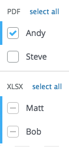

## Need

```gherkin
As an admin
I want a centralized way to control sharing settings on documents
So that I can be productive.
```


## Deliverables

We are given a list of documents. Each document has a list of collaborators. A
collaborator can have access to more than one document.

We want to aggregate all of the collaborators for all the documents into a
single a list so we can make edits easier.


Each collaborator in that list will have an attribute marking if they have
access to all of the documents, none of them, or some of them. A collaborator
that has access to all of the documents is marked as checked. A collaborator
that has access only to some of them is also marked as checked, but with a
partial checkmark. A collaborator that doesn't have access to anything is marked
as unchecked.

You can check and uncheck collaborators in this aggregated list. A checked
collaborator can turn unchecked. An unchecked collaborator can turn checked. A
partially checked collaborator can turn checked. Once checked, it can only turn
unchecked.

When submitting the modified list, the following will happen:

- a checked collaborator will receive access to all of the documents,
- an unchecked collaborator will have their access revoked from all of the
  documents and
- a partially checked collaborator will have their access left untouched.


## Solution

Add your code in [`src/sharing.js`](src/sharing.js).


### Step 1

Implement a method, `aggregateCollaboratorPermissions`, that will receive a
list of documents and will return the aggregated list of collaborators.


### Step 2

Implement a method, `updateDocuments`, that will receive the same list of
documents and an aggregated list of collaborators. It will return a new list of
documents with their updated lists of collaborators. The method will respect
the rules in the `Deliverables` section.


### Bonus



Each document also has an attribute defining its type. A document of a certain
type will only be shared to collaborators that know how to handle that type of
document. There can't be 2 documents with different types being shared to the
same person.

Enhance the functions above so that a collaborator is marked as fully selected
if has access to all of the documents of the type it knows how to handle.
Consequently, a collaborator is marked as partially checked if they only have
access to some of the documents they know how to handle. A collaborator will
be marked as unchecked if they don't have access to anything.


#### Setup

Make sure you have the latest [node](https://nodejs.org/download/) and
[npm](https://docs.npmjs.com/getting-started/installing-node) installed and run
`npm install` to install the dependencies necessary for this project.

You can write your solutions using [ES6 syntax](http://es6-features.org/), but
you don't need to. ES6 is backwards compatible with current JavaScript syntax
and adds mostly syntactic sugar on top of it.

The code is transpiled using [BabelJS](https://babeljs.io/). While the latest
Node [supports](https://kangax.github.io/compat-table/es6/) some of the new ES6
syntax, BabelJS has much broader support.

We've already installed [lodash](https://lodash.com/docs) for you so feel free
to use it. You can install any other packages you need, just make sure you add
them to the `package.json` file by using `--save` or `--save-dev` during [`npm
install`](https://docs.npmjs.com/cli/install).


#### Testing

The above functions are covered by tests. They're there to make sure your
solution is correct and complete. To run them use `npm test`. The tests are
written using [mocha](http://mochajs.org/) and [chai](http://chaijs.com/).


#### Grading

You will be graded on the number of tests that pass and on the quality of your
code (style, performance, use of best practices etc.).
